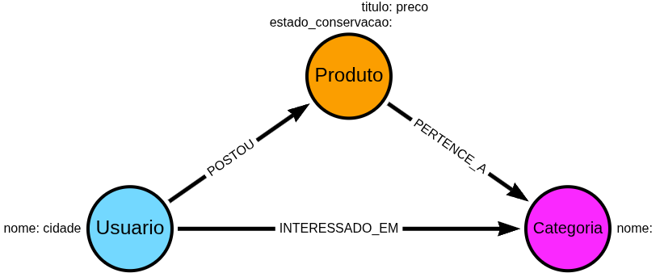

# Projeto CVT (Comprar, Vender ou Trocar) - Banco de Dados em Grafos com Neo4j 🚀

Este projeto faz parte do desafio de projeto da **DIO (Digital Innovation One)** em parceria com a **Neo4j**. O objetivo é demonstrar a aplicação de bancos de dados em grafos para resolver problemas de conexões complexas em um sistema de trocas e vendas.

## 📌 Contexto do Problema
No projeto **CVT**, o desafio é conectar usuários que possuem produtos para troca com outros usuários que têm interesse nessas categorias. Em um banco de dados relacional (SQL), encontrar "ciclos de troca" (A quer o que B tem, B quer o que C tem, e C quer o que A tem) é computacionalmente caro. No **Neo4j**, essas conexões são naturais e performáticas.

## 📐 Modelo do Grafo
O modelo foi desenhado utilizando o [Arrows.app](https://arrows.app/).

- **Usuário:** Ator principal do sistema.
- **Produto:** Itens cadastrados para troca/venda.
- **Categoria:** O "hub" que conecta a oferta à demanda.

### Visualização do Esquema:
*(Dica: Após exportar a imagem do Arrows.app, coloque-a na pasta /img e atualize o link abaixo)*


## 📥 Dataset e Scripts de Carga
Os dados estão organizados em arquivos CSV para facilitar a importação.

### Como executar a carga:
1. Certifique-se de que o seu Neo4j (Desktop ou Aura) tenha acesso à internet.
2. Execute os comandos abaixo no Neo4j Browser:

```cypher
// 1. Criar Usuários
LOAD CSV WITH HEADERS FROM '[https://raw.githubusercontent.com/](https://raw.githubusercontent.com/)[edirley123/desafio-neo4j-cvt]/main/data/usuarios.csv' AS row
MERGE (u:Usuario {id: row.id})
SET u.nome = row.nome, u.cidade = row.cidade;

// 2. Criar Categorias
LOAD CSV WITH HEADERS FROM '[https://raw.githubusercontent.com/](https://raw.githubusercontent.com/)[edirley123/desafio-neo4j-cvt]/main/data/categorias.csv' AS row
MERGE (c:Categoria {nome: row.nome});

// 3. Criar Produtos e Relacionamentos
LOAD CSV WITH HEADERS FROM '[https://raw.githubusercontent.com/](https://raw.githubusercontent.com/)[edirley123/desafio-neo4j-cvt/main/data/produtos.csv' AS row
MATCH (u:Usuario {id: row.usuario_id})
MATCH (c:Categoria {nome: row.categoria_nome})
MERGE (p:Produto {id: row.id})
SET p.titulo = row.titulo, p.preco = toFloat(row.preco)
MERGE (u)-[:POSTOU]->(p)
MERGE (p)-[:PERTENCE_A]->(c);
